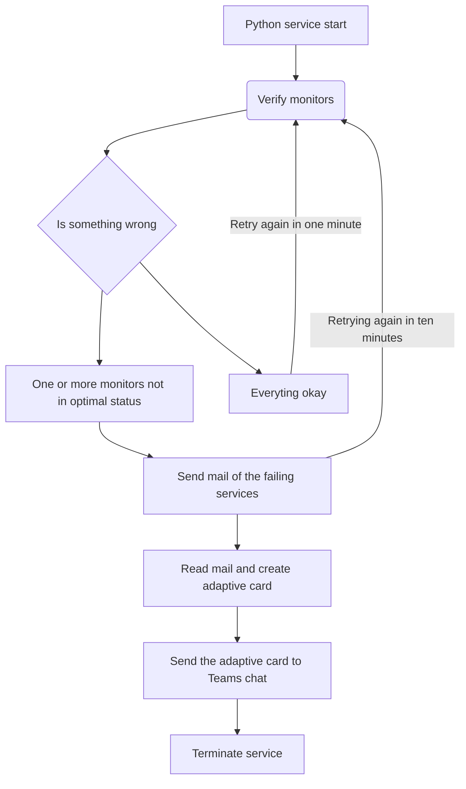

# monitors-shared-tech

This is a project for verify the status of the services of the monitors in shared tech, and additionally has a service of mail sender to notify the user whenever a service is not in optimal status

# Clone the repo

    Git clone <http url>

    cd monitors-shared-tech

# activate the virtual environment

    py -m venv myenv

    myenv\Scripts\activate.bat

# Install the project dependences

    pip install -r requirements.txt

# Install the project dependences

    py monitor_watcher.py

And there you go

## Project diagram

